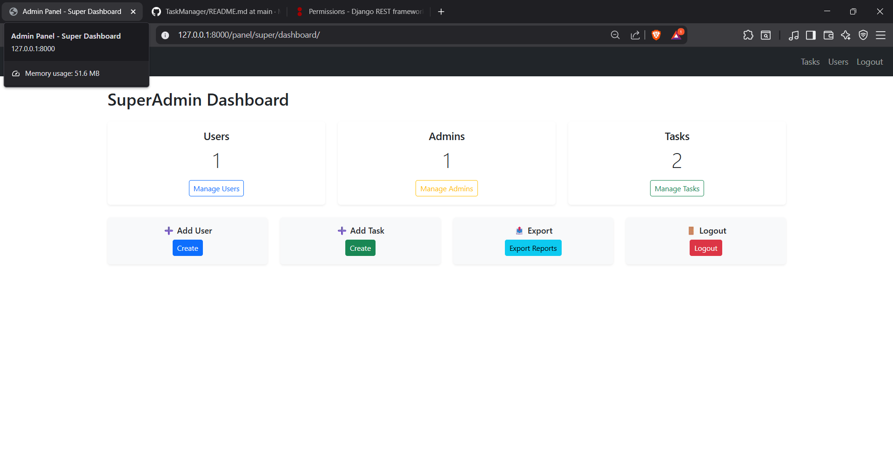
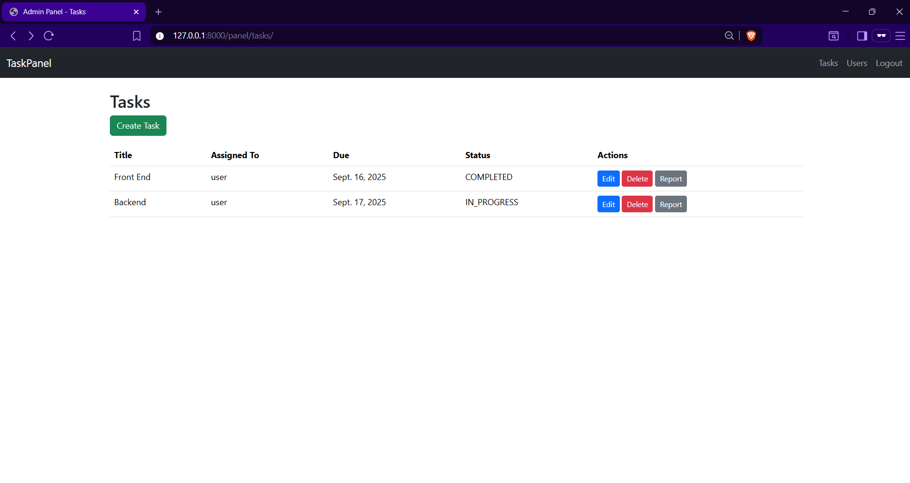
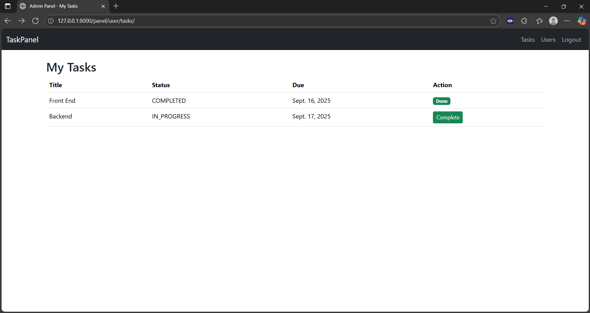

# 📝 Task Management Application with Completion Reports

A role-based **Task Management System** built with **Python Django + Django REST Framework (DRF)**, featuring:  
- **JWT Authentication** for secure API access.  
- **Role-based access control** (SuperAdmin, Admin, User).  
- **Custom Admin Panel** (built with Django templates, not default admin).  
- **Task Completion Workflow** with reports and worked hours.  
- **Export functionality** for SuperAdmins.  

---

## 🚀 Features

### 🔑 Authentication
- JWT-based login (`/api/auth/login/`)  
- Secure token refresh (`/api/auth/refresh/`)  

### 👤 User Roles
- **SuperAdmin**  
  - Manage users & admins (create, delete, assign roles).  
  - Assign users to admins.  
  - Manage all tasks.  
  - View all completion reports.  
  - Export completed task reports (CSV).  

- **Admin**  
  - Assign tasks to their managed users.  
  - Manage tasks within their scope.  
  - View completion reports of their users.  

- **User**  
  - View only their assigned tasks.  
  - Mark tasks as completed with **completion report + worked hours**.  

### 📌 Task Workflow
- Tasks have: `Title`, `Description`, `Assigned To`, `Due Date`, `Status`.  
- Status options: `Pending`, `In Progress`, `Completed`.  
- When marking as `Completed`, **Users must submit**:  
  - Completion Report 📝  
  - Worked Hours ⏱️  

---

## ⚙️ Tech Stack
- **Backend**: Django, Django REST Framework  
- **Auth**: SimpleJWT  
- **Database**: SQLite (default, easy to demo)  
- **Frontend (Admin Panel)**: Django Templates + Bootstrap  

---

## 📂 Project Structure
task_manager/
┣ accounts/ # custom User model (role-based)
┣ tasks/ # Task model, serializers, APIs
┣ admin_panel/ # custom admin panel (HTML templates)
┣ templates/ # shared templates (Bootstrap-based)
┣ requirements.txt
┗ README.md


---

## 🔗 API Endpoints

### Auth
| Method | Endpoint             | Description                  |
|--------|----------------------|------------------------------|
| POST   | `/api/auth/login/`   | Get JWT token (username, pw) |
| POST   | `/api/auth/refresh/` | Refresh access token         |

### Tasks
| Method | Endpoint                  | Role       | Description |
|--------|---------------------------|------------|-------------|
| GET    | `/api/tasks/`             | User       | Get own tasks |
| PUT    | `/api/tasks/{id}/`        | User       | Update task status → requires report + worked hours if `Completed` |
| GET    | `/api/tasks/{id}/report/` | Admin, SuperAdmin | View report & worked hours of completed task |

---

## 🖥️ Admin Panel URLs

| Role       | URL                               | Description |
|------------|-----------------------------------|-------------|
| SuperAdmin | `/panel/super/dashboard/`         | Dashboard with stats + controls |
| Admin      | `/panel/admin/dashboard/`         | Dashboard with managed users + tasks |
| User       | `/panel/user/tasks/`              | View own tasks, complete tasks |
| All        | `/panel/login/`, `/panel/logout/` | Login/Logout |

---
## 🖼️ Screenshots

### 📊 SuperAdmin Dashboard


### 👨‍💼 Admin Dashboard


### 👤 User Tasks


## 🔒 Role Permissions

| Action                        | SuperAdmin | Admin | User |
|-------------------------------|:----------:|:-----:|:----:|
| Login to panel                | ✅         | ✅    | ✅   |
| View own tasks                | ✅         | ✅    | ✅   |
| Mark task as completed        | ❌         | ❌    | ✅   |
| View task reports             | ✅         | ✅    | ❌   |
| Create / edit / delete tasks  | ✅         | ✅    | ❌   |
| View all tasks                | ✅         | ✅    | ❌   |
| Create new user               | ✅         | ❌    | ❌   |
| Delete user                   | ✅         | ❌    | ❌   |
| Assign users to Admin         | ✅         | ❌    | ❌   |
| Export completed task reports | ✅         | ❌    | ❌   |

✅ = Allowed  
❌ = Not Allowed


## 🛠️ Setup & Installation

```bash
# Clone repository
git clone https://github.com/YOUR_USERNAME/task-manager.git
cd task-manager

# Create virtual environment
python -m venv venv
source venv/bin/activate   # On Windows: venv\Scripts\activate

# Install dependencies
pip install -r requirements.txt

# Run migrations
python manage.py makemigrations
python manage.py migrate

# Create SuperAdmin
python manage.py createsuperuser
# (then edit user in /admin/ or via DB to set role=SUPERADMIN)

